# 항해 플러스 1주차 - TDD & 동시성 제어

## 🌊 항해.. 첫 파도를 가르며.. 

꽤 길었던 설날 황금 연휴의 마지막 즈음, 항해 플러스에 결국 발을 들이게 되었다.   
~~사실, 그 덫인 줄 뻔히 알면서도 스스로 걸려든 셈이다.~~

나는 항상 **서른이 되기 전**(~~1년 밖에 안 남았다..~~), **좋은 개발 문화를 가진 조직**으로 이직하고 싶었다. 🏢   
그래서 **작년 하반기(10월)부터 이직**을 위한 여정을 시작하였다.

**이력서 수정 ✏️**도 틈틈히 해보고,   
**우아한테크코스 🚛**에 지원도 해보고,   
**코틀린**이 배워보고 싶어 **사이드 프로젝트 🚊**에 참여도 하고,  
실제로 몇몇 회사에 지원해봤지만 **이력서조차 통과하지 못했다.** 😅

솔직히 말하면, 이직에 대한 자신감은 **여전히 부족하다**.  
과제 전형이면 그나마 시도라도 해볼 것 같은데, **코딩 테스트**와 **기술 면접**은 진짜... 골칫거리다. 🤮

> 신입 때는 어찌저찌 했는데.. 왜 오히려 7년차인 지금 더 어려운 건지 모르겠다. 🤷  
> ~~일단 이력서부터 합격 해보자.. 🤣~~

그러던 중, 알고리즘에 들락날락 거리는 **항해 플러스 홍보 글**이 눈에 밟혔다.   
평소 같았으면 애써 부정하며 못본척했겠지만..   
단 한 단어에 난 **긁히고** 말았다. 마치 날 저격하듯이 말이다. 🎯

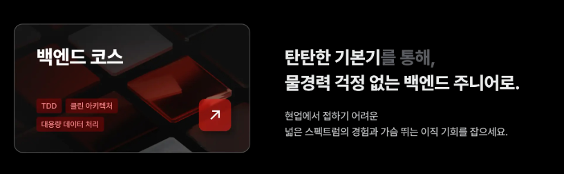

그 단어는 "**물 경 력💦**" 이었다.   
고작 **3글자**가 날 애처롭게 만들어 버렸다.   
~~항해 마케팅 팀은 상을 받아도 될 것 같다... 😂~~

> 실제로 돌이켜보면 스터디나 사이드 프로젝트를 같이 진행해보면 나보다 낮은 연차 팀원들이 훨씬 나보다 더 잘했던 것 같다... 😅

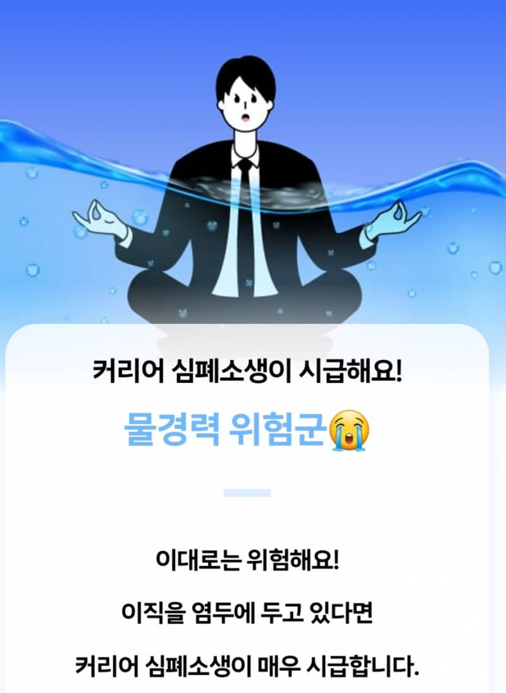

**항해 플러스**는 지금까지의 경력이 무력해질만큼의 탄탄한 커리큘럼으로 구성된 10주 동안 진행하는 부트캠프다.   
그것도 현직자를 대상으로 한 커리큘럼이라니...

그리고, 빅테크 기업의 시니어 개발자로 계신 코치님들께 멘토링을 받을 수 있는 점이 끌렸던 것 같다.

비싸다고 생각할 새도 없이, "**정신을 차렸을 땐 이미 결제를 끝낸 뒤였다.**" 😂

## 🧶 두 달간의 기다림

본 과정을 시작하기 전에, 항해 플러스 백엔드 8기 참여자들과 함께 **사전 스터디 프로그램**을 진행했다.

먼저 합류한 다른 인원들과 네트워킹을 다질 수 있을 것 같았고,     
예습 겸, 본 과제 전에 미리 감을 잡기 위해 참여했다.

[🔗 사전 스터디 프레임워크 Repository](https://github.com/hanghae-plus-backend-8/prestudy-framework-spring/tree/discphy)

사전 스터디를 참여하면서 항해플러스 [Github Organization](https://github.com/hanghae-plus-backend-8)도 만들었지만?  
반응은 썰렁했다. 🤣

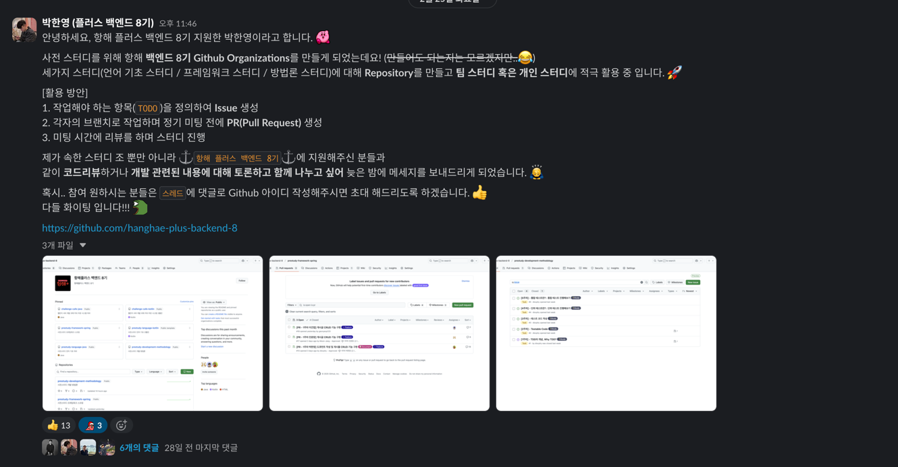

그렇게 사전스터디에 참여하며 본 과정을 기다리던 도중,  
평소에 참여해보고 싶었던 [우빈(전 우아한형제들, 현 캐치테이블, 1등 이력서)님](https://www.linkedin.com/in/%EC%9A%B0%EB%B9%88-%EB%B0%95-556077215/)의 스터디가 인프런을 통해 열린다는 소식을 접했다.

항해 플러스 본과정과 약 1주일 정도 겹치긴 했지만, 기회를 놓치고 싶지 않아 두 마리 토끼를 잡기로 결심했다. 🐰  
> 우빈님의 강의를 듣고 개발이 더 재밌어지고 몰입하게 된 입장에서, 꼭 한 번 참여해보고 싶었다.

그래서 이 글을 쓰는 시점에도 두 개 모두 병행 중이다.. 😅  
[🔗 인프런 워밍업 클럽 스터디 WIL 블로그 시리즈](https://velog.io/@discphy/series/%EC%9D%B8%ED%94%84%EB%9F%B0-%EC%9B%8C%EB%B0%8D%EC%97%85-%ED%81%B4%EB%9F%BD)

(참고로, 사전 스터디와 병행하려 했던 히든 챌린지는 결국 손도 못 댔다... 😀)

## 🚣 시작, 근데 왜 조타수?

두 달간의 기다림 끝에, 드디어 1주차 과제를 위한 **오프라인 정기 모임**에 참석했다.  
교육과정 설명이 끝난 뒤, 함께 **10주간 여정을 떠날 팀원**들과 자기소개를 나누고, 이어서 팀장과 부팀장을 뽑는 시간이 주어졌다.

문제는 여기서 시작되었다...

평소에 침묵을 잘 못견디는 나는 말문을 자연스레 트게 되었고,   
연차가 제일 높다는 이유로 자연스럽게 **팀장**을 맡게 되어 있었다… 😅  
~~실무에서도 리드를 해봐서 알지만, 자리를 맡게되면 여러가지로 신경을 많이 써야하는 나인지라 팀원이 되고 싶었었다...~~

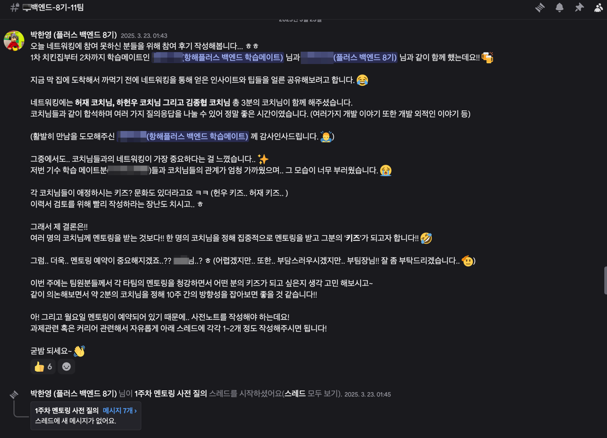
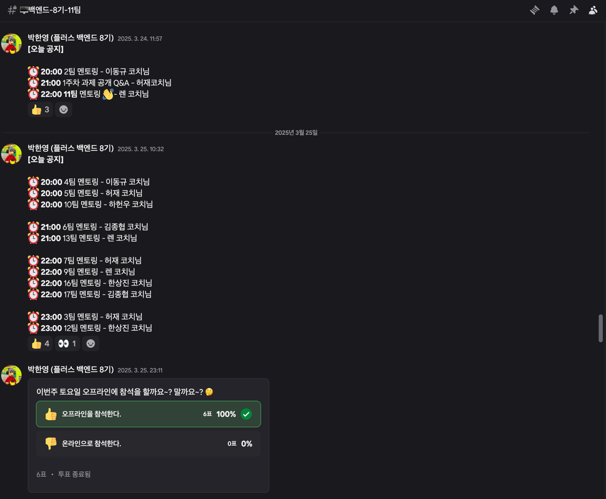
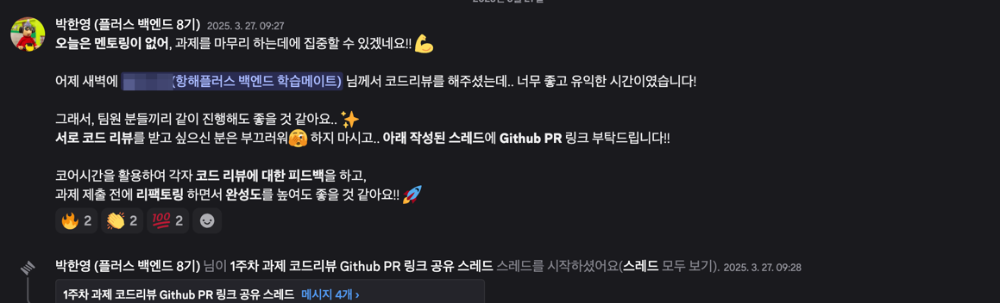
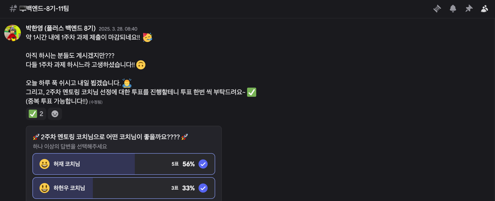

(잘하고 있는진 모르겠지만, 나름 열심히 하고 있다...🙃)  

정기 모임 시간 이후에는 코치님을 포함한 8기 전 인원이 네트워킹을 다질 수 있는 시간도 가졌다. 🍻   
이때 [갓재](https://www.linkedin.com/in/jae-heo-7950621b1/) 코치님께서 좋은 조언을 많이 해주셔서, 얻어가는 인사이트도 많았다.   
(감사합니다 허재 코치님!! 🙇‍♂️)

내가 속한 **11팀**이랑도 많이 친해졌다..! 💯

## 💪 1주차 과제 - TDD & 동시성 제어 

일요일부터 본격적으로 1주차 과제를 진행하기 시작했다.
1주차 메인 과제의 **TDD**는 최근 스터디에서 자주 접했던 터라 `TDD`는 조금은 익숙했다. 

[🔗 TDD 스터디 학습했던 내용](https://velog.io/@discphy/%EC%9D%BD%EA%B8%B0-%EC%A2%8B%EC%9D%80-%EC%BD%94%EB%93%9C-%EB%A6%AC%ED%8C%A9%ED%86%A0%EB%A7%81) 

문제는 **동시성 제어**였다.   
실무에서 경험해본 적도 없었고, 개념도 생소했다.   
(~~3년차 때인가? 우편번호 데이터를 저장할 때 `synchronized`키워드를 써본 적이 있었던 것 같다. 그치만 이건 모르는게 맞다.~~)

그래서, 황급히 [영한님](https://www.inflearn.com/users/74366/@yh)의 강의를 구매하였다.

[🔗 영한님 동시성 강의 링크](https://www.inflearn.com/course/%EA%B9%80%EC%98%81%ED%95%9C%EC%9D%98-%EC%8B%A4%EC%A0%84-%EC%9E%90%EB%B0%94-%EA%B3%A0%EA%B8%89-1/dashboard)

하반부에 나오는 동시성에 대해서 강의를 수강하고,  
그것을 내 **자신만의 언어**로 정리하며 학습하였다.

[🔗 동시성 관련 문서 작성](https://github.com/discphy/hhplus-tdd/blob/week1/1/README.md#%EB%8F%99%EC%8B%9C%EC%84%B1-%EC%A0%9C%EC%96%B4-%EB%B0%A9%EC%8B%9D-%EB%B0%8F-%EC%A0%81%EC%9A%A9-%EC%9E%A5%EB%8B%A8%EC%A0%90-%EA%B8%B0%EC%88%A0-%EB%B3%B4%EA%B3%A0%EC%84%9C)

> 개념적인 이해는 강의만한게 없는 것 같다.   
> 영한님의 강의는 진짜 퀄이 좋은 것 같다... 👍

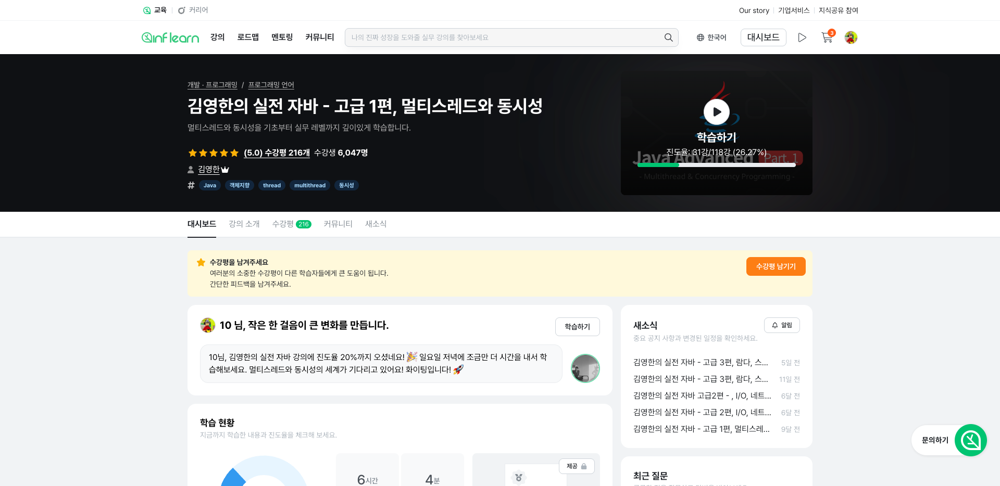

아래는, 1주차에 진행했던 내 **루틴**과 **타임라인**이다.

### 🏋️‍♀️ 루틴
- [ ] ⏰ **6:00** - 🛌 기상
- [ ] ⏰ **6:40 ~ 8:00** - 🛫 출근
- [ ] ⏰ **8:00 ~ 9:00** - 📚 인프런 강의 수강 
- [ ] ⏰ **9:00 ~ 12:00** - 👨🏻‍💻 오전 업무 및 점심 식사
- [ ] ⏰ **12:00 ~ 13:00** - ⚓️ 항해 과제 진행 1차
- [ ] ⏰ **13:00 ~ 18:00** - 👨🏻‍💻 오후 업무 
- [ ] ⏰ **18:00 ~ 20:00** - ⚓️ 멘토링 청강 및 항해 과제 진행 2차
- [ ] ⏰ **20:00 ~ 21:00** - 🛬 퇴근 
- [ ] ⏰ **21:00 ~ 02:30** - ⚓️ 항해 과제 진행 3차

### 📅 타임라인

- [ ] ✅ **1일차(일요일) ~ 3일차(화요일)**    
  + 요구사항 분석 및 API 명세 작성
  + TDD 도메인 단위테스트 작성 및 기존 클래스 단위 테스트 작성
  + 서비스 레이어 구현
  + 컨트롤러 레이어 구현
  + 리팩토링 

- [ ] ✅ **4일차(수요일) ~ 5일차(목요일)**
  + 동시성 제어 코드 구현 
  + 동시성 적용 문서 작성 
  + 리팩토링

출근 시간은 평소와 같았지만, 늦게 자서 그런지 피곤하긴 했다. 😴  
하지만? 나쁘진 않았다. **유지만 할 수 있다면** 이 루틴을 유지(?)해보는 것도 좋겠다. 

그렇게 1주차 과제를 제출했다. 👏

[🔗 과제 PR](https://github.com/discphy/hhplus-tdd/pull/2)

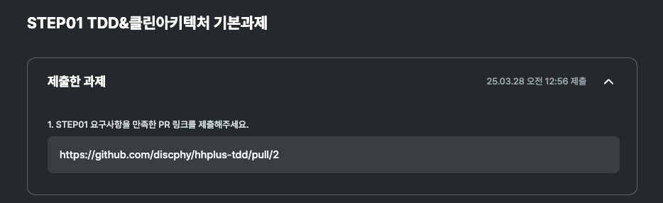

## 감격의 BP? 👍

과제 마무리 하루 전, 유행하는 ChatGPT 네컷 만화를 만들어 "**항해 커뮤니티**"에 공유했다.  
이 네컷 만화는 매주 토요일에 진행하는 **토요지식회**에도 소개(?)되었다! 😁

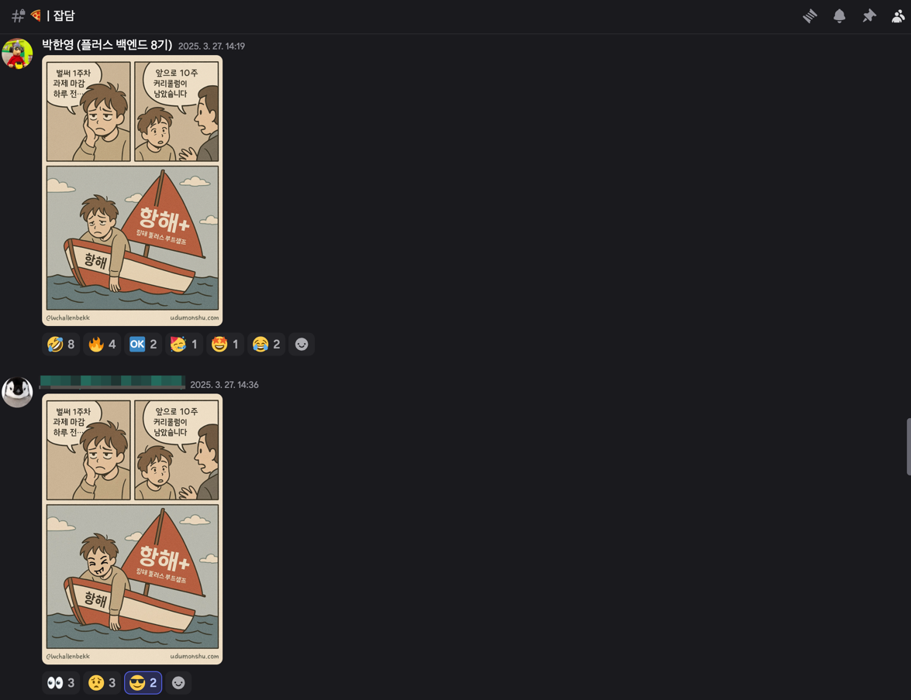
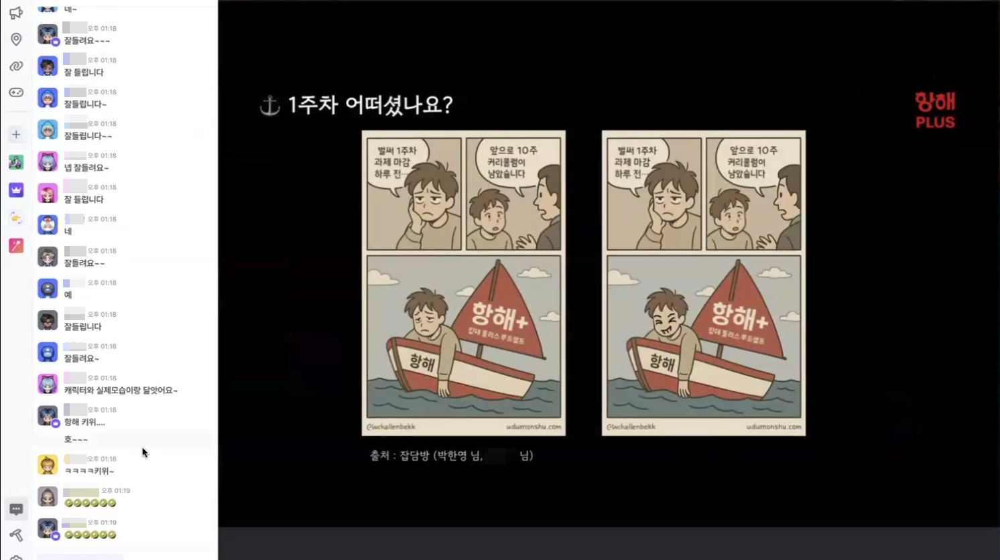

그리고, **💎아고라** 채널을 활용해서   
과제를 수행하며 고민했던 포인트를 공유했고, 그 과정에서 유익한 인사이트도 많이 얻을 수 있었다.

> 답변 주신 분들, 정말 감사드립니다! 🙇‍♂️

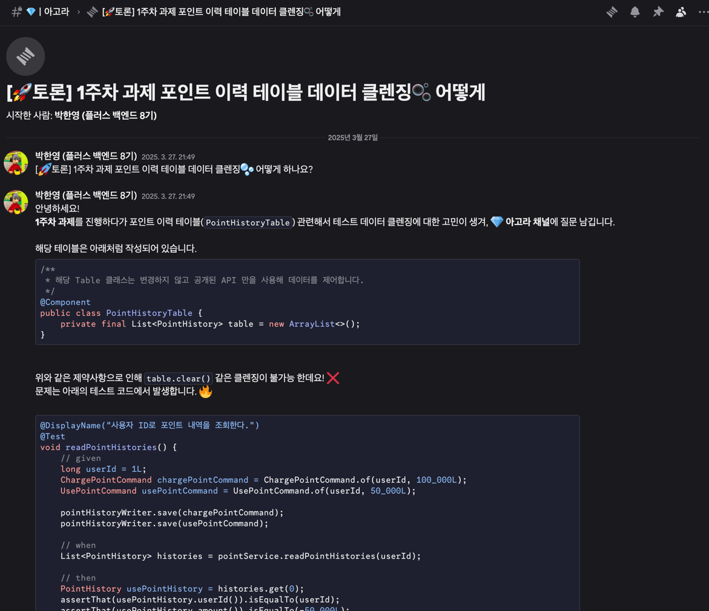

토요일 정규모임에는 **토요지식회, 코드리뷰, 다음 주차 과제 발제, 과제 평가 확인 등** 진행되었다.     
이 정규모임은 오프라인 참석은 선택 사항이었지만, 놀랍게도 우리 팀원들이 오프라인에 많이 참석해주셨다.

(감사합니다!! 11팀!! 👍 꽤나.. 팀워크가 좋을지도!? 🤔)
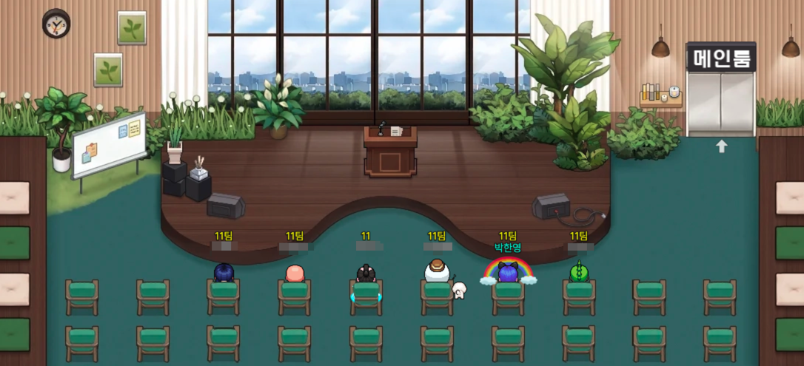

그렇게 1주차가 마무리 되었고, 2주차가 시작되었다...  

과제 평가는… 감사하게도 **Best Practice 👍**에 선정되었다!

렌 코치님께서도 **좋은 피드백**을 주셔서 감사했다!! 🙇‍♂️

멘토링 예약에는 아쉽게 실패했지만.. 😂 
그래도 열심히 과제를 인정받은 것 같아 뿌듯했다. 🍀

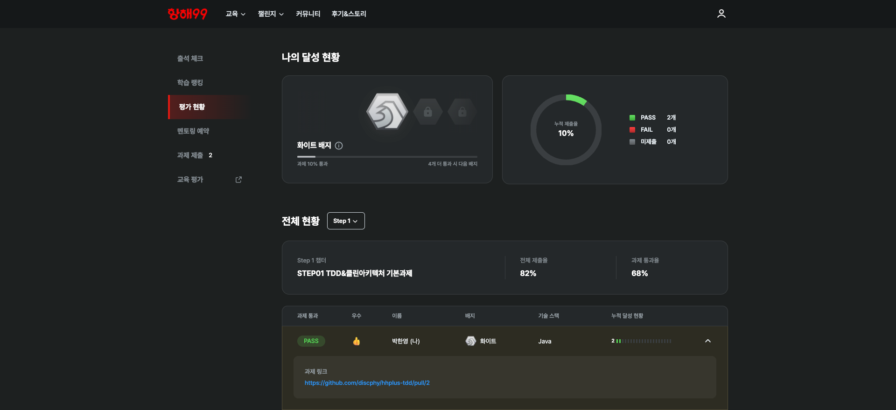
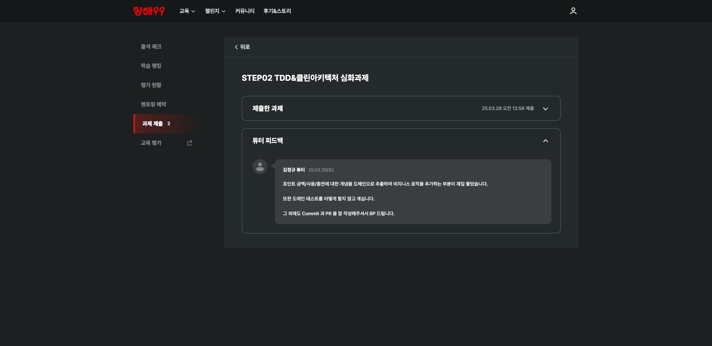

다음 주차는 **서버 구축의 설계 단계**이다!    
사실 코드 작성보다 **설계가 훨씬 더 중요**하다고 생각한다. ⭐️  
(업무할 때 생각해보면, 코드 작성하는 것보다 머리 뜯는 시간이 더 많은 것 같다... 😅)

2주차도 화이팅하면서, 이만 글을 마무리해보려 한다. 👏 

[출처]
+ 항해 플러스 : https://hanghae99.spartacodingclub.kr/plus/be

